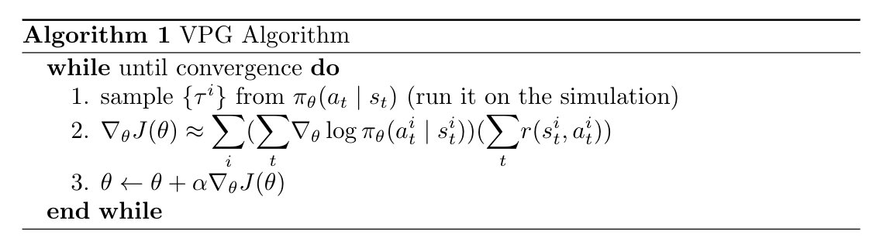

# Vanilla Policy Gradient / REINFORCE

## Synopsis

J is the expected sum of the rewards of a policy. In this case we simply optimize J over our policy (which is a differentiable structure like a neural net). 

## Features

| Feature type | Feature |
| RL type | Single Agent RL |
| ------------ | ------- |
| Model? | Yes |
| Policy? | On |
| Action Space ? | Both |
| State Space ? | Both |

## Algorithm

## Heuristics

The implemented heuristics are

- gamma (reduced future reward)

- generalized advantage estimation (gae)

- advantage normalization (mean, std deviation)

- baseline (neural network) for comparison

- reward to go
